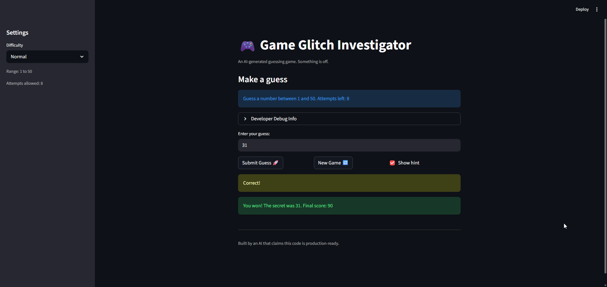

# 🎮 Game Glitch Investigator: The Impossible Guesser

## 🚨 The Situation

You asked an AI to build a simple "Number Guessing Game" using Streamlit.
It wrote the code, ran away, and now the game is unplayable. 

- You can't win.
- The hints lie to you.
- The secret number seems to have commitment issues.

## 🛠️ Setup

1. Install dependencies: `pip install -r requirements.txt`
2. Run the broken app: `python -m streamlit run app.py`

## 🕵️‍♂️ Your Mission

1. **Play the game.** Open the "Developer Debug Info" tab in the app to see the secret number. Try to win.
2. **Find the State Bug.** Why does the secret number change every time you click "Submit"? Ask ChatGPT: *"How do I keep a variable from resetting in Streamlit when I click a button?"*
3. **Fix the Logic.** The hints ("Higher/Lower") are wrong. Fix them.
4. **Refactor & Test.** - Move the logic into `logic_utils.py`.
   - Run `pytest` in your terminal.
   - Keep fixing until all tests pass!

## 📝 Document Your Experience

- [x] Describe the game's purpose.

The Game Glitch Investigator is a Streamlit-based number guessing game where the player picks a difficulty (Easy, Normal, or Hard), and tries to guess a secret number within a limited number of attempts. The app gives hints after each guess to guide the player higher or lower.

- [x] Detail which bugs you found.

I found 9 bugs by manually playing through every difficulty and documenting each one in `reflection.md`:
1. Submitting an empty guess still decremented the attempts counter.
2. The hint messages were backwards — "Go HIGHER!" when too high, "Go LOWER!" when too low.
3. Clicking "New Game" after winning did nothing.
4. Clicking "New Game" after losing did nothing.
5. The UI hardcoded "Guess a number between 1 and 100" regardless of difficulty, and the attempts counter was off by one.
6. The game ended one attempt early across all difficulties.
7. Hard difficulty (1-50) was easier than Normal (1-100) — the ranges were swapped.
8. On even-numbered attempts, the secret was converted to a string, causing erratic comparisons.
9. The score formula used `attempt_number + 1`, over-penalizing the player by 10 points on every win.

- [x] Explain what fixes you applied.

I refactored all game logic from `app.py` into `logic_utils.py` and fixed each bug:
- Swapped the hint messages so they point in the correct direction.
- Corrected difficulty ranges: Easy=1-20, Normal=1-50, Hard=1-100.
- Fixed the score formula by removing the extra `+ 1`.
- Made the "Too High" penalty a consistent -5 instead of an erratic even/odd split.
- Initialized attempts to 0 instead of 1.
- Made the UI range text dynamic using the actual `low` and `high` values.
- Reset `status`, `score`, and `history` in the "New Game" handler so it works after win/loss.
- Moved attempt increment after validation so empty guesses don't burn a turn.
- Removed the string conversion of the secret on even attempts.

## 📸 Demo

## 🚀 Stretch Features

- [ ] [If you choose to complete Challenge 4, insert a screenshot of your Enhanced Game UI here]
